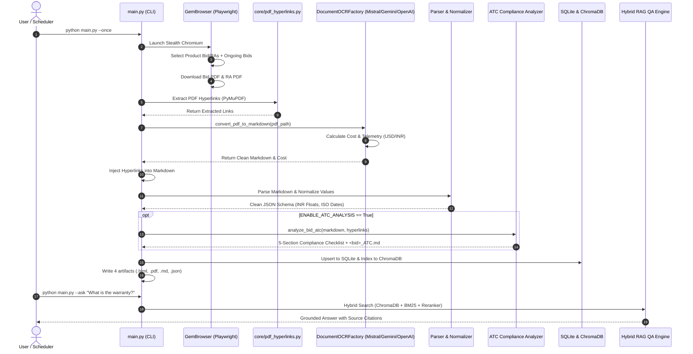

# 🏗️ GeM Intelligence System — Complete Architecture & Flow Guide

An end-to-end architectural specification and user guide for the **GeM Tender Ingestion, Pluggable Cloud/Local OCR Engine, ATC Compliance Analyzer, and Hybrid RAG Retrieval Pipeline**.

---

## 🗺️ 1. End-to-End System Architecture

The following diagram illustrates the complete data lifecycle—from Playwright browser ingestion to Hybrid RAG retrieval:

```mermaid
flowchart TD
    subgraph INGESTION ["1. Ingestion Layer (Playwright Stealth Engine)"]
        CLI["CLI Trigger (main.py)"] --> BROWSER["GemBrowser (Playwright Chromium)"]
        BROWSER -->|Direct Search| ADV["Advanced Search (/advance-search)"]
        BROWSER -->|Category Iteration| LIST["Listing Feed (/all-bids)"]
        ADV --> CARD["DOM Bid Card (.card)"]
        LIST --> CARD
        CARD -->|Save Snapshot| HTML_FILE["downloads/<bid>/<bid>.html"]
        CARD -->|Download Stream| PDF_BID["downloads/<bid>/<bid>.pdf"]
        CARD -->|Download Stream| PDF_RA["downloads/<bid>/<bid>_RA.pdf"]
    end

    subgraph ENRICHMENT ["2. Hyperlink Extraction & Preprocessing"]
        PDF_BID --> PYMUPDF["PyMuPDF Link Scanner (core/pdf_hyperlinks.py)"]
        PDF_RA --> PYMUPDF
        PYMUPDF --> LINKS["Extracted Hyperlinks (URI targets & labels)"]
    end

    subgraph SLICING ["3. Selective PDF Slicing & Boundary Detection"]
        PDF_BID --> SPLITTER["PDF Boundary Scanner (core/pdf_splitter.py)"]
        SPLITTER -->|Pages 1..N| CORE_PDF["Core Sliced PDF (downloads/<bid>/<bid>_core.pdf)"]
        SPLITTER -->|Pages N..End| LOCAL_ATC["PyMuPDF ATC Clauses Extractor (Zero Cost)"]
    end

    subgraph OCR_LAYER ["4. Pluggable Multi-Provider OCR Layer"]
        CORE_PDF --> FACTORY["DocumentOCRFactory (core/ocr/factory.py)"]
        FACTORY -->|OCR_PROVIDER=mistral| MISTRAL["Mistral OCR (mistral-ocr-3-0)"]
        FACTORY -->|OCR_PROVIDER=gemini| GEMINI["Google Gemini (gemini-2.5-flash)"]
        FACTORY -->|OCR_PROVIDER=openai| OPENAI["OpenAI Vision (gpt-4o-mini)"]
        FACTORY -->|OCR_PROVIDER=mineru| MINERU["Mineru VLM (Local GPU vLLM)"]
        
        MISTRAL --> COST["Pricing Engine (core/ocr/pricing.py)"]
        GEMINI --> COST
        OPENAI --> COST
        MINERU --> COST
        COST --> TELEMETRY["Telemetry & Savings Tracking (USD & INR)"]
        
        MISTRAL --> RAW_MD["Raw Core Markdown"]
        GEMINI --> RAW_MD
        OPENAI --> RAW_MD
        MINERU --> RAW_MD
    end

    subgraph STRUCTURING ["5. Hybrid Stitching & Data Normalization"]
        RAW_MD & LOCAL_ATC --> STITCH["Hybrid Markdown Stitcher (core/pdf_splitter.py)"]
        STITCH --> INJECT["Hyperlink Injection Engine"]
        LINKS --> INJECT
        INJECT --> ENRICHED_MD["downloads/<bid>/<bid>.md"]
        
        ENRICHED_MD --> PARSER["Core Parser (core/parser.py)"]
        PARSER --> RAW_SCHEMA["Structured Bid Schema"]
        RAW_SCHEMA --> NORMALIZER["Data Normalizer (core/normalizer.py)"]
        NORMALIZER -->|Lakhs/Crores -> Float| CLEAN_SCHEMA["Normalized Financials & Dates"]
    end

    subgraph COMPLIANCE ["5. ATC Compliance Analyzer"]
        ENRICHED_MD --> ATC_ENGINE["ATC Analyzer (pipeline/atc_analyzer.py)"]
        LINKS --> ATC_ENGINE
        ATC_ENGINE --> ATC_MD["downloads/<bid>/<bid>_ATC.md"]
        ATC_ENGINE --> ATC_JSON["5-Section Compliance Checklist"]
    end

    subgraph PERSISTENCE ["6. Storage & Vector Indexing"]
        CLEAN_SCHEMA & ATC_JSON & TELEMETRY --> FINAL_JSON["downloads/<bid>/<bid>.json"]
        FINAL_JSON --> SQLITE[("SQLite Database (storage/gem_bids.db)")]
        FINAL_JSON --> CHROMA[("ChromaDB Vector Store (storage/chroma_db)")]
    end

    subgraph RAG_LAYER ["7. Hybrid RAG Search & Question Answering"]
        USER_Q["User Question (main.py --ask / --chat)"] --> HYBRID["Hybrid Retriever (rag/vector_store.py)"]
        CHROMA -->|Dense Cosine (bge-base-en-v1.5)| HYBRID
        SQLITE -->|Metadata Filter| HYBRID
        ENRICHED_MD -->|BM25 Sparse Search| HYBRID
        HYBRID --> RERANK["Cross-Encoder Reranker (bge-reranker-base)"]
        RERANK --> PROMPT["Context Assembly + Gemini LLM"]
        PROMPT --> ANSWER["Grounded Answer with Citations & Costs"]
    end
```

---

## 🧩 2. Core Features Breakdown & Internal Mechanics

### Feature 1: Playwright Stealth Browser Engine
* **Source:** [`core/browser.py`](file:///C:/Projects/GeM/Scrapper%20&%20RAG%20Pipeline/core/browser.py), [`utils/antibot.py`](file:///C:/Projects/GeM/Scrapper%20&%20RAG%20Pipeline/utils/antibot.py)
* **Purpose:** Resilient automated interaction with the dynamic AngularJS/Bootstrap GeM portal without getting blocked by anti-bot systems.
* **Internal Mechanics:**
  - **Stealth Profile Injection:** Overrides `navigator.webdriver`, mocks plugins, and sets authentic browser fingerprints.
  - **Dynamic User-Agent & Viewport Rotation:** Rotates screen resolutions and OS User-Agents across runs.
  - **State-Aware Filter Selection:** Detects whether `#ongoing_bids` is already checked by default to prevent accidental untoggling.
  - **Fast Click with Force Fallback:** Uses an 8-second standard click timeout with immediate fallback to `force=True` if iCheck jQuery wrappers intercept pointer events.
  - **Dual Mode Scraping:** Supports category pagination traversal (`/all-bids`) as well as direct tender lookup (`/advance-search`).

#### Usage:
```powershell
# Scrape a specific single tender directly:
python main.py --bid "GEM/2026/B/7747876"

# Run a single scraping pass across all categories:
python main.py --once

# Continuous hourly background daemon:
python main.py
```

---

### Feature 2: PyMuPDF Hyperlink Extractor & Markdown Injection
* **Source:** [`core/pdf_hyperlinks.py`](file:///C:/Projects/GeM/Scrapper%20&%20RAG%20Pipeline/core/pdf_hyperlinks.py), [`pipeline/scraper.py`](file:///C:/Projects/GeM/Scrapper%20&%20RAG%20Pipeline/pipeline/scraper.py)
* **Purpose:** Extracts native clickable URLs embedded inside GeM Bid & RA PDFs (such as technical specifications, BOQ sheets, certificates, and advisory URLs) and makes them discoverable by AI.
* **Internal Mechanics:**
  - Opens the downloaded PDF using PyMuPDF (`fitz`).
  - Scans `page.get_links()` across all pages to extract external `uri` destinations, coordinates, and nearby text.
  - Injects a formatted `## Extracted Document Hyperlinks` section into the converted Markdown before parsing and vector indexing.
  - Embeds the structured link objects into `final_bid["hyperlinks"]`.

#### Sample Extracted Hyperlinks Output:
```json
[
  {
    "page": 1,
    "uri": "https://bidplus.gem.gov.in/showradocumentPdf/9980764",
    "text": "Click here to view RA Document",
    "source": "bid"
  }
]
```

---

### Feature 3: Pluggable Multi-Provider OCR Layer & Costing Engine
* **Source:** [`core/ocr/`](file:///C:/Projects/GeM/Scrapper%20&%20RAG%20Pipeline/core/ocr/)
  - [`core/ocr/base.py`](file:///C:/Projects/GeM/Scrapper%20&%20RAG%20Pipeline/core/ocr/base.py) (Base class & interfaces)
  - [`core/ocr/pricing.py`](file:///C:/Projects/GeM/Scrapper%20&%20RAG%20Pipeline/core/ocr/pricing.py) (Cost catalog & currency converter)
  - [`core/ocr/mistral_provider.py`](file:///C:/Projects/GeM/Scrapper%20&%20RAG%20Pipeline/core/ocr/mistral_provider.py) (Mistral OCR)
  - [`core/ocr/gemini_provider.py`](file:///C:/Projects/GeM/Scrapper%20&%20RAG%20Pipeline/core/ocr/gemini_provider.py) (Google Gemini Document Vision)
  - [`core/ocr/openai_provider.py`](file:///C:/Projects/GeM/Scrapper%20&%20RAG%20Pipeline/core/ocr/openai_provider.py) (OpenAI GPT-4o Vision)
  - [`core/ocr/mineru_provider.py`](file:///C:/Projects/GeM/Scrapper%20&%20RAG%20Pipeline/core/ocr/mineru_provider.py) (Local GPU Mineru engine)
  - [`core/ocr/factory.py`](file:///C:/Projects/GeM/Scrapper%20&%20RAG%20Pipeline/core/ocr/factory.py) (Dynamic resolver)
* **Purpose:** Converts multi-page PDF documents into clean, structured Markdown with table preservation, zero GPU dependency for cloud engines, and exact financial cost tracking.
* **Internal Mechanics:**
  - **Dynamic Factory Pattern:** Resolves the active provider via `OCR_PROVIDER` in `.env`.
  - **Zero GPU Cloud Bypass:** When `mistral`, `gemini`, or `openai` is selected, the local vLLM / Mineru subprocess is bypassed entirely, freeing system RAM and GPU VRAM.
  - **Mistral OCR Engine:** Uses `mistral-ocr-3-0` with `table_format="html"`. Pre-processes pages with PyMuPDF whitespace cropping and substitutes `[tbl-X.html]` references with valid HTML `<table>` blocks.
  - **In-Memory Thread-Safe Cache:** Caches OCR results by MD5 hash with atomic locking to eliminate duplicate API requests.
  - **Telemetry & Cost Tracking:** Computes token/page usage and records estimated costs in both USD and INR (`USD_TO_INR_RATE = 86.50`).

#### Provider Comparison & Cost Table:

| Provider | Active Model | Pricing Unit | 18-Page Tender Cost (USD) | 18-Page Tender Cost (INR) | Hardware Required |
| :--- | :--- | :--- | :--- | :--- | :--- |
| **Mistral OCR** *(Default)* | `mistral-ocr-3-0` | \$1.00 / 1,000 pages | **\$0.0180** | **₹1.56** | ❌ None (Cloud API) |
| **Google Gemini** | `gemini-2.5-flash` | \$0.075 / 1M in, \$0.30 / 1M out | **~\$0.0025** | **₹0.22** | ❌ None (Cloud API) |
| **OpenAI** | `gpt-4o-mini` | \$0.15 / 1M in, \$0.60 / 1M out | **~\$0.0050** | **₹0.43** | ❌ None (Cloud API) |
| **Mineru Local** | Local vLLM | Compute only | **\$0.00** | **₹0.00** | ✅ GPU with 4GB+ VRAM |

#### Configuration in `.env`:
```bash
# Select active engine: mistral | gemini | openai | mineru
OCR_PROVIDER=mistral

# Mistral Settings
MISTRAL_API_KEY=your_mistral_api_key
MISTRAL_OCR_MODEL=mistral-ocr-3-0

# Gemini Settings
GEMINI_API_KEY=your_gemini_api_key
GEMINI_OCR_MODEL=gemini-2.5-flash

# OpenAI Settings
OPENAI_API_KEY=your_openai_api_key
OPENAI_OCR_MODEL=gpt-4o-mini
```

---

### Feature 4: Core Parser & Financial Normalizer
* **Source:** [`core/parser.py`](file:///C:/Projects/GeM/Scrapper%20&%20RAG%20Pipeline/core/parser.py), [`core/normalizer.py`](file:///C:/Projects/GeM/Scrapper%20&%20RAG%20Pipeline/core/normalizer.py)
* **Purpose:** Transforms unstructured OCR Markdown tables into a strongly-typed, normalized JSON schema.
* **Internal Mechanics:**
  - **Table Parsing:** Natively handles Markdown tables and HTML `<table>` elements via BeautifulSoup.
  - **Indian Currency Normalization:** Converts colloquial Indian financial strings (`"18.85 Lakhs"`, `"1.5 Crore"`, `"₹ 50,000/-"`) into standardized integer/float values (`1885000.0`, `15000000.0`, `50000.0`).
  - **Date Normalization:** Converts portal dates (`"11-08-2026 12:00:00"`) into standard ISO 8601 strings with timezone offset (`2026-08-11T12:00:00+05:30`), calculates bid duration in days, and flags `is_expired`.
  - **Schema Validation:** Flags missing critical values and returns `validation_data` with data-quality warnings.

#### Normalizer Example:
```python
# Raw Markdown Input: "Estimated Bid Value: 18.85 Lakhs"
# Normalized Output:
{
  "financials": {
    "estimated_value_raw": "18.85 Lakhs",
    "estimated_value_inr": 1885000.0,
    "estimated_value_formatted": "₹18.85 Lakh",
    "emd": {
      "required": false,
      "amount_inr": 0.0
    }
  }
}
```

---

### Feature 5: AI-Powered ATC Compliance Extractor
* **Source:** [`pipeline/atc_analyzer.py`](file:///C:/Projects/GeM/Scrapper%20&%20RAG%20Pipeline/pipeline/atc_analyzer.py)
* **Purpose:** Analyzes the Buyer Added Additional Terms and Conditions (ATC) and generates a structured, actionable compliance matrix.
* **Internal Mechanics:**
  - Isolates the ATC section from the tender markdown.
  - Prompts Google Gemini (or local Qwen) with strict extraction instructions.
  - Categorizes requirements into **5 distinct compliance dimensions**:
    1. **Standard Bid Documents** (GST, PAN, Turnover, Audited Balance Sheet).
    2. **Buyer Clarified ATC Uploads** (Certificates, undertakings, OEM authorizations).
    3. **Exemption Proofs** (MSE / Startup exemption eligibility and required forms).
    4. **Physical Submissions** (Hardcopy samples, original EMD DDs, delivery addresses).
    5. **Key Commercial & Operational Terms** (Warranty period, delivery timeline, payment terms, SLA penalty).
  - Outputs a dedicated `<bid_no>_ATC.md` document and integrates structured JSON into SQLite.

#### Usage:
```powershell
# Analyze a specific tender's ATC terms:
python main.py --analyze-atc "downloads/GEM_2026_B_7747876"

# Batch analyze all downloaded tenders:
python main.py --analyze-atc "downloads"
```

---

### Feature 6: Auto-Migrating Persistence & 4-Artifact Archive
* **Source:** [`storage/database.py`](file:///C:/Projects/GeM/Scrapper%20&%20RAG%20Pipeline/storage/database.py)
* **Purpose:** Stores complete tender records in SQLite and creates a standardized 4-file directory for every tender.
* **Internal Mechanics:**
  - **Dedicated Tender Directory:** Every tender is saved into `downloads/<safe_bid_no>/`:
    1. `<safe_bid_no>.html`: Raw HTML snapshot from GeM.
    2. `<safe_bid_no>.pdf`: Original official tender PDF.
    3. `<safe_bid_no>.md`: Converted Markdown with injected hyperlinks.
    4. `<safe_bid_no>.json`: Full assembled JSON record.
  - **Self-Healing SQLite Schema Migration:** Checks table schema on startup; dynamically executes `ALTER TABLE` to add missing columns (such as `atc_analysis` or `telemetry`) without dropping existing data.
  - **Automatic JSON Export:** Synchronizes `storage/gem_bids.json` on every run.

---

### Feature 7: Hybrid RAG System & Question Answering
* **Source:** [`rag/vector_store.py`](file:///C:/Projects/GeM/Scrapper%20&%20RAG%20Pipeline/rag/vector_store.py), [`rag/qa.py`](file:///C:/Projects/GeM/Scrapper%20&%20RAG%20Pipeline/rag/qa.py)
* **Purpose:** Delivers fast, grounded answers to complex compliance questions across the tender database.
* **Internal Mechanics:**
  - **Sliding Window Chunking:** Splits tender Markdown into overlapping chunks (500 tokens with 100-token overlap), preserving document structure and section headings.
  - **Dense Embeddings:** Embeds text using `BAAI/bge-base-en-v1.5` into a local ChromaDB collection (`storage/chroma_db`).
  - **Sparse Keyword Search:** Executes BM25 keyword matching for exact procurement identifiers (e.g. `GEM/2026/B/7747876`, `OEM authorization`).
  - **Reciprocal Rank Fusion (RRF) & Cross-Encoder Reranking:** Merges dense and sparse candidates, scores them via `BAAI/bge-reranker-base`, and passes the top chunks to the synthesis LLM.

#### Usage:
```powershell
# Ask a natural language compliance question:
python main.py --ask "What are the exemption rules for MSEs in the medical analyzer bid?"

# Filter search results by product type:
python main.py --ask "desktop computer" --filter product_type=Product

# Launch interactive terminal chat:
python main.py --chat

# Re-index all database records into ChromaDB:
python main.py --reindex
```

---

### Feature 8: Storage Maintenance & Cleanup CLI
* **Source:** [`main.py`](file:///C:/Projects/GeM/Scrapper%20&%20RAG%20Pipeline/main.py)
* **Purpose:** Fine-grained commands to manage databases, clean caches, purge artifacts, and inspect system statistics.

#### Commands Summary:

```powershell
# Inspect database and vector store counts:
python main.py --stats

# Clean SQLite database only:
python main.py --clean-db

# Clean ChromaDB vector store only:
python main.py --clean-chroma

# Clean all downloaded PDFs & artifacts:
python main.py --clean-downloads

# Clean all log files:
python main.py --clean-logs

# Standard reset (Database + ChromaDB):
python main.py --reset

# Factory reset (Purge everything):
python main.py --reset-all
```

---

## 🔄 3. Complete Data Flow Diagram


