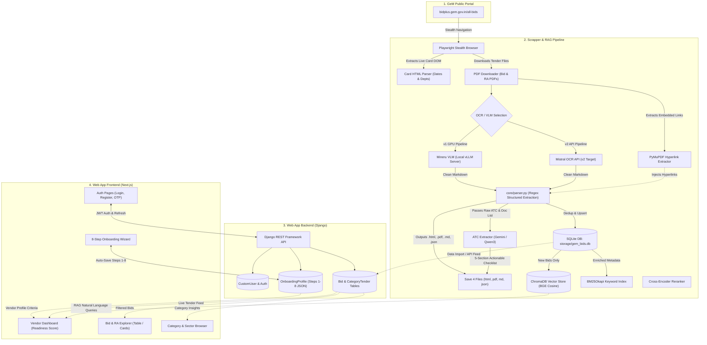

# 🏛️ GeMBridge — Master Architecture, Workflow & System Blueprint

> **Unified System Documentation**  
> **Project Root:** `c:\Projects\GeM`  
> **Sub-Projects:** `Scrapper & RAG Pipeline` (branch: `development_v2`) + `Web App` (Django REST + Next.js 16)  
> **Target Platform:** Government e-Marketplace (GeM) — `bidplus.gem.gov.in`

---

## 📑 Table of Contents

1. [Executive Summary & Purpose](#1-executive-summary--purpose)
2. [Root Directory Layout](#2-root-directory-layout)
3. [End-to-End System Workflow](#3-end-to-end-system-workflow)
4. [Sub-Project 1: Scrapper & RAG Pipeline](#4-sub-project-1-scrapper--rag-pipeline)
   - [4.1 Architecture & Core Components](#41-architecture--core-components)
   - [4.2 Playwright Stealth Scraper & Evasion](#42-playwright-stealth-scraper--evasion)
   - [4.3 Card HTML Parsing & Date Integrity](#43-card-html-parsing--date-integrity)
   - [4.4 Document Harvesting & Hyperlink Extraction](#44-document-harvesting--hyperlink-extraction)
   - [4.5 OCR Engines: Mineru VLM vs Mistral OCR Migration](#45-ocr-engines-mineru-vlm-vs-mistral-ocr-migration)
   - [4.6 Output Artifact Specification (4 Files per Bid)](#46-output-artifact-specification-4-files-per-bid)
   - [4.7 Storage Layer (SQLite Deduplication & JSON Export)](#47-storage-layer-sqlite-deduplication--json-export)
   - [4.8 Advanced Hybrid RAG Engine](#48-advanced-hybrid-rag-engine)
   - [4.9 ATC Extractor Engine (Qwen3-4B vs Gemini 2.5)](#49-atc-extractor-engine-qwen3-4b-vs-gemini-25)
   - [4.10 CLI Commands & Scheduler](#410-cli-commands--scheduler)
5. [Sub-Project 2: Web App](#5-sub-project-2-web-app)
   - [5.1 Full-Stack Architecture](#51-full-stack-architecture)
   - [5.2 Django REST Backend Architecture](#52-django-rest-backend-architecture)
   - [5.3 Authentication App (`apps/auth`)](#53-authentication-app-appsauth)
   - [5.4 Bids & Category Tender App (`apps/bids`)](#54-bids--category-tender-app-appsbids)
   - [5.5 Onboarding App (`apps/onboarding`)](#55-onboarding-app-appsonboarding)
   - [5.6 Next.js Frontend Architecture](#56-nextjs-frontend-architecture)
   - [5.7 8-Step Progressive Onboarding Flow](#57-8-step-progressive-onboarding-flow)
   - [5.8 Vendor Dashboard & Readiness Scoring](#58-vendor-dashboard--readiness-scoring)
   - [5.9 Bids & RA Explorer (Dual View Modes)](#59-bids--ra-explorer-dual-view-modes)
   - [5.10 Category & Sector Tender Browser](#510-category--sector-tender-browser)
   - [5.11 Network Resiliency & Token Interceptor (`lib/api.ts`)](#511-network-resiliency--token-interceptor-libapits)
6. [Unified System Integration (The "Bridge")](#6-unified-system-integration-the-bridge)
7. [Environment Configurations Reference](#7-environment-configurations-reference)
8. [Installation & Execution Guide](#8-installation--execution-guide)
9. [Development Roadmap & Pending Enhancements](#9-development-roadmap--pending-enhancements)

---

## 1. Executive Summary & Purpose

The **Government e-Marketplace (GeM)** is the apex public procurement portal for Central and State Government departments, PSUs, and autonomous defense entities in India. While GeM processes millions of tenders worth billions of dollars annually, Indian vendors, MSMEs, and startups encounter major friction:

* **Information Overload:** Tender documents range from 10 to 100+ pages containing complex legal jargon, buyer-added clauses (ATC), and conflicting criteria.
* **Complex Eligibility Thresholds:** Stringent requirements regarding average annual turnover, past experience, EMD exemptions, and Make in India (MII) preference rules.
* **Scattered Information:** Critical dates on the listing card often diverge from dates inside the PDF text due to corrigenda, leading to missed deadlines.

**GeMBridge** solves this end-to-end by unifying two robust sub-projects into one platform:
1. **`Scrapper & RAG Pipeline`:** An autonomous, AI-driven ingestion pipeline that scrapes active tenders, bypasses anti-bot defenses, extracts hyperlinks, converts complex PDFs into clean Markdown using Vision-Language Models (VLM) / OCR, structures domain criteria, and indexes content into a hybrid RAG search engine.
2. **`Web App`:** A full-stack vendor management and procurement portal comprising a Django REST Framework backend and a modern Next.js 16 frontend. It guides vendors through an 8-step GeM onboarding audit, matches their capability profile against live tenders, and provides deep tender exploration and AI assistance.

---

## 2. Root Directory Layout

```
c:/Projects/GeM/
│
├── GEMBRIDGE_MASTER_WORKFLOW.md    ← Complete master architectural manual (this document)
├── README.md                       ← Root quick-start guide
│
├── Scrapper & RAG Pipeline/        ← Ingestion, VLM OCR, Document Extraction & Vector Search Engine
│   │                                  (Git Branch: development_v2)
│   ├── main.py                     ← Unified CLI entry point for all scraping, stats, and RAG queries
│   ├── MINERU_MARKDOWN_PASER.py    ← Mineru & Docling PDF parser script
│   ├── PROJECT_OVERVIEW.md         ← Roadmap, status, and pending tasks for pipeline
│   ├── brain.md                    ← Master specification, domain rules & 17-section mapping
│   ├── MISTRAL_OCR_MIGRATION_PLAN.md ← Architectural roadmap to switch to Mistral OCR API
│   ├── requirements.txt            ← Dependencies: PyTorch cu130, Playwright, ChromaDB, Transformers
│   ├── setup_env.sh                ← Linux/WSL environment bootstrap script
│   ├── sync_to_github.sh           ← Git push automation helper
│   ├── .env.example                ← Template configuration file
│   │
│   ├── config/
│   │   ├── __init__.py
│   │   └── settings.py             ← Global settings, env loader, delay timings, model names
│   │
│   ├── core/
│   │   ├── __init__.py
│   │   ├── browser.py              ← Playwright stealth browser manager (GemBrowser)
│   │   └── parser.py               ← HTML card details parser, date normalizer, regex PDF extractor
│   │
│   ├── pipeline/
│   │   ├── __init__.py
│   │   ├── scraper.py              ← Main scraping orchestration & Mineru VLM loop
│   │   └── scheduler.py            ← Continuous hourly loop with new-bid alert dispatch
│   │
│   ├── rag/
│   │   ├── __init__.py
│   │   ├── embedder.py             ← BGE dense embedding encoder & metadata-card chunker
│   │   ├── vector_store.py         ← ChromaDB cosine store + BM25Okapi + Cross-Encoder reranker
│   │   ├── llm.py                  ← Prompt builder with zero-hallucination constraints (Ollama/OpenAI)
│   │   └── query_engine.py         ← Public RAG query interface, intent scaler & exit handlers
│   │
│   ├── storage/
│   │   ├── __init__.py
│   │   ├── database.py             ← SQLite ORM (BidDatabase: deduplication, upsert, stats)
│   │   ├── gem_bids.db             ← SQLite database containing parsed bids and run logs
│   │   ├── gem_bids.json           ← Clean JSON catalog exported after scrape runs
│   │   └── chroma_db/              ← Persistent ChromaDB vector database files
│   │
│   ├── utils/
│   │   ├── __init__.py
│   │   ├── antibot.py              ← Anti-bot delays, user-agent pool, human-like mouse jitters
│   │   ├── logger.py               ← Multi-module rotating file and console logger
│   │   └── pdf_hyperlinks.py       ← PyMuPDF embedded hyperlink extractor and markdown injector
│   │
│   ├── ATC EXTRACTOR/              ← Deep intelligence engine for Buyer Added ATC clauses
│   │   ├── INFERENCE_ON_MARKDOWN.py← LLM analysis engine (Gemini 2.5 Flash / Qwen3-4B-GGUF)
│   │   ├── Prompt.txt              ← 5-section prompt rulebook for actionable compliance checklists
│   │   ├── Start_Llama_CPP_Qwen3_4B_GGUF_Server.sh ← Local llama.cpp launch script
│   │   ├── TEST_MARKDOWNS/         ← Test input markdowns
│   │   └── TEST_MARKDOWNS_EXTRA/   ← Supplementary test markdowns
│   │
│   ├── downloads/                  ← Output artifact storage (1 subfolder per bid number)
│   │   └── GEM_2026_B_XXXXXXX/     ← Contains: .html, .pdf, .md, .json
│   │
│   ├── logs/                       ← Module-specific rotating log files
│   └── STANDLONE TEST SCRIPTS/     ← Isolated unit scripts for scraper and ATC testing
│
└── Web App/                        ← Vendor Application Monorepo (Django + Next.js)
    ├── .env.example                ← Environment configuration template for backend and frontend
    ├── GeMBridge_Onboarding_Inputs.txt ← Specification for all 8 onboarding steps & input fields
    │
    ├── backend/                    ← Django 5.1.4 REST Framework API
    │   ├── manage.py               ← Django management CLI
    │   ├── requirements.txt        ← Django, DRF, SimpleJWT, django-cors-headers, django-filter
    │   ├── create_superuser.py     ← Superuser provisioning helper
    │   ├── make_fixtures.js        ← Compiles dummy bids into Django fixture format
    │   ├── make_category_fixtures.js ← Compiles category tenders into Django fixtures
    │   │
    │   ├── config/
    │   │   ├── __init__.py
    │   │   ├── asgi.py             ← ASGI config
    │   │   ├── wsgi.py             ← WSGI config
    │   │   ├── urls.py             ← Root URL router (`/admin/`, `/api/auth/`, `/api/bids/`, `/api/onboarding/`)
    │   │   └── settings.py         ← Django settings (PostgreSQL/SQLite, SimpleJWT, CORS, CustomUser)
    │   │
    │   └── apps/
    │       ├── auth/               ← Custom user authentication app (gemauth)
    │       │   ├── models.py       ← CustomUser model (email/mobile login, UUID, OTP fields)
    │       │   ├── serializers.py  ← Register, Login, Token, ForgotPassword serializers
    │       │   ├── views.py        ← Auth endpoints (login, register, logout, OTP reset, me)
    │       │   ├── urls.py         ← Auth routes (`/api/auth/...`)
    │       │   └── permissions.py  ← Custom role and authorization permissions
    │       │
    │       ├── bids/               ← Bid catalog & tender retrieval app
    │       │   ├── models.py       ← Bid and CategoryTender models
    │       │   ├── views.py        ← BidViewSet, CategoryTenderViewSet, BidDetailView
    │       │   ├── filters.py      ← DjangoFilterBackend criteria (bid_type, status, high_value)
    │       │   ├── serializers.py  ← Serializers for bids and category insights
    │       │   ├── urls.py         ← Bid routes (`/api/bids/...`)
    │       │   └── fixtures/       ← Seed data (bids.json, category_tenders.json)
    │       │
    │       └── onboarding/         ← 8-step vendor registration & compliance profile
    │           ├── models.py       ← OnboardingProfile (step1_data to step8_data as JSON)
    │           ├── serializers.py  ← Step-specific and full profile serializers
    │           ├── views.py        ← Progressive step updates and final submit view
    │           └── urls.py         ← Onboarding routes (`/api/onboarding/...`)
    │
    └── frontend/                   ← Next.js 16 App Router Frontend
        ├── package.json            ← Dependencies: React 19, Tailwind v4, Framer Motion, Lucide
        ├── tsconfig.json           ← TypeScript configuration
        ├── next.config.ts          ← Next.js build and routing settings
        ├── postcss.config.mjs      ← PostCSS / Tailwind integration
        │
        └── src/
            ├── app/                ← App Router page routes
            │   ├── layout.tsx      ← Root layout (Theme & Auth providers, fonts)
            │   ├── page.tsx        ← Landing / Marketing page
            │   ├── globals.css     ← Global variables, color palettes, animations
            │   ├── dashboard/page.tsx ← Vendor Dashboard (profile score, bid alerts, quick links)
            │   ├── onboarding/page.tsx← 8-step interactive onboarding wizard
            │   ├── bids/
            │   │   ├── ra/page.tsx ← Interactive Bid & RA explorer (Table & Card Grid modes)
            │   │   └── category/page.tsx ← Category & Sector tender browser
            │   └── auth/
            │       ├── login/page.tsx       ← Email/Mobile password login
            │       ├── register/page.tsx    ← Multi-role vendor registration
            │       └── forgot-password/page.tsx ← 3-step OTP password reset
            │
            ├── components/         ← Reusable UI & business widgets
            │   ├── Navbar.tsx      ← Navigation header with theme toggle & user badge
            │   ├── Footer.tsx      ← Application footer
            │   ├── BidCard.tsx     ← Visual bid card component
            │   ├── BidTable.tsx    ← Dense tabular bid explorer with sorting
            │   ├── BidModal.tsx    ← Deep-dive modal inspecting bid & eligibility criteria
            │   ├── TenderRow.tsx   ← Expandable accordion row for category tenders
            │   ├── SidebarFilters.tsx ← Advanced sidebar filter controls
            │   ├── auth/           ← Auth form components (LoginForm, RegisterForm, OTP)
            │   ├── onboarding/     ← Stepper, navigation, auto-save status badge
            │   │   └── steps/      ← Step 1 to Step 8 individual form section components
            │   └── ui/             ← Base primitives (button, card, input, badge)
            │
            ├── lib/                ← Application utilities & Context providers
            │   ├── api.ts          ← Resilient fetch client with JWT token auto-refresh queue
            │   ├── authContext.tsx ← React context for user state and token management
            │   ├── onboardingContext.tsx ← React context syncing 8-step onboarding data
            │   ├── schemas.ts      ← Zod validation schemas
            │   ├── useTheme.ts     ← Light/Dark theme persistence hook
            │   └── utils.ts        ← Styling helpers (cn class merger)
            │
            ├── types/              ← TypeScript interfaces
            │   ├── auth.ts         ← User, AuthState, Step1 through Step8 interfaces
            │   └── bid.ts          ← Bid, CategoryTender, and Filter types
            │
            └── data/               ← Fallback & local mock datasets
                ├── dummyBids.ts
                └── categoryTenders.ts
```

---

## 3. End-to-End System Workflow

The following flowchart illustrates how raw government data is harvested, analyzed, transformed, and delivered to the end vendor:



---

## 4. Sub-Project 1: Scrapper & RAG Pipeline

### 4.1 Architecture & Core Components
The scraper is built as an enterprise-grade pipeline designed for unattended, long-running operation. It scrapes, parses, indexes, and enables semantic search over active GeM bids without human intervention.

### 4.2 Playwright Stealth Scraper & Evasion
* **File:** [`core/browser.py`](file:///C:/Projects/GeM/Scrapper%20&%20RAG%20Pipeline/core/browser.py)
* **Anti-Bot Techniques:**
  * Uses Playwright with Chromium launched with `--disable-blink-features=AutomationControlled`.
  * Injects JavaScript pre-navigation scripts that delete `window.navigator.webdriver`.
  * Randomizes User-Agents across a pool of 5 modern browser configurations (Windows, Mac, Linux).
  * Randomizes viewport resolutions (1920×1080, 1440×900, 1366×768, 1536×864).
  * Sets the browser locale to `en-IN` and timezone to `Asia/Kolkata`.
  * Implements randomized jitter delays between page loads (4–8s), cards (1–3s), and pagination (3–6s) via [`utils/antibot.py`](file:///C:/Projects/GeM/Scrapper%20&%20RAG%20Pipeline/utils/antibot.py).
* **"Ongoing Bids/RA" Selection:** Immediately after applying category filters, the browser triggers `select_ongoing_bids()`. This forces GeM to return only currently open bids, bypassing expired and archived tenders.

### 4.3 Card HTML Parsing & Date Integrity
* **File:** [`core/parser.py`](file:///C:/Projects/GeM/Scrapper%20&%20RAG%20Pipeline/core/parser.py)
* **The Date Mismatch Problem:** In Indian procurement, corrigenda frequently extend bid closing dates. While the downloadable PDF often retains the original date, the portal's card DOM displays the updated date.
* **The Solution:** The scraper treats the live card HTML as the **single source of truth** for dates (`get_card_details()`):
  * Extracts `Start Date: DD-MM-YYYY HH:MM AM/PM` and `End Date: DD-MM-YYYY HH:MM AM/PM`.
  * Converts dates into standard 24-hour format: `DD-MM-YYYY HH:MM:SS`.
  * PDF dates are only used as fallback if card parsing fails.

### 4.4 Document Harvesting & Hyperlink Extraction
* **File:** [`utils/pdf_hyperlinks.py`](file:///C:/Projects/GeM/Scrapper%20&%20RAG%20Pipeline/utils/pdf_hyperlinks.py)
* Downloads the primary **Bid Document PDF** and, if available, the **Reverse Auction (RA) PDF**.
* Uses `PyMuPDF` (`fitz`) to extract all embedded web addresses and external file links from the PDF text.
* Injects these links into a dedicated Markdown section before RAG indexing, ensuring that buyers' external terms (Google Drive links, departmental portals, technical drawings) are captured.

### 4.5 OCR Engines: Mineru VLM vs Mistral OCR Migration
* **Current Implementation (Mineru VLM):**
  * Invokes `Mineru_Document_To_Markdown` running against a local `vLLM` server.
  * GPU profile: `max_gpu_util=0.78`, `model_len=4096`, `batch_size=16` (optimized for RTX 2050 4GB).
  * Uses zero-save mode (`output_dir=None`) to receive the parsed Markdown in memory without disk clutter.
* **Target Migration (`development_v2` Roadmap):**
  * Documented in [`MISTRAL_OCR_MIGRATION_PLAN.md`](file:///C:/Projects/GeM/Scrapper%20&%20RAG%20Pipeline/MISTRAL_OCR_MIGRATION_PLAN.md).
  * Replaces local GPU-heavy vLLM with the hosted **Mistral OCR API** (`mistral-ocr-latest`).
  * Eliminates heavy dependencies (`vllm`, `flash-attn`, CUDA toolkits) and provides an identical Markdown output string contract via [`core/ocr.py`](file:///C:/Projects/GeM/Scrapper%20&%20RAG%20Pipeline/core/ocr.py).

### 4.6 Output Artifact Specification (4 Files per Bid)
Every scraped tender is organized into a dedicated directory: `downloads/<safe_bid_no>/`:
1. `<safe_bid_no>.html`: Complete outer HTML snapshot of the bid card.
2. `<safe_bid_no>.pdf`: Official government bid specification PDF.
3. `<safe_bid_no>.md`: High-fidelity Markdown generated by the OCR engine.
4. `<safe_bid_no>.json`: Fully normalized JSON schema containing:
   * `bid`: Metadata, numbers, product type, process kind, base type.
   * `card`: Items, quantities, department, start/end datetimes, document URLs.
   * `pdf`: Extracted financial values, EMD amounts, evaluation methods, buyer details.
   * `full_pdf_text`: Cleaned text used for vector generation.

### 4.7 Storage Layer (SQLite Deduplication & JSON Export)
* **File:** [`storage/database.py`](file:///C:/Projects/GeM/Scrapper%20&%20RAG%20Pipeline/storage/database.py)
* **Table `bids`:** Primary key on `document_url`.
* **Deduplication:**
  * If a bid is new: inserted with `first_seen = now`, `last_seen = now`, and `is_new = 1`.
  * If already exists: updates `last_seen = now`, `ra_no`, `corrigendum_url`, and flags `is_new = 0`.
  * Triggers vector indexing in ChromaDB **only** for newly discovered bids.
* **Auto-Export:** Continuously synchronizes to [`storage/gem_bids.json`](file:///C:/Projects/GeM/Scrapper%20&%20RAG%20Pipeline/storage/gem_bids.json) (omitting massive raw PDF text to keep file size compact).

### 4.8 Advanced Hybrid RAG Engine
* **Files:** [`rag/embedder.py`](file:///C:/Projects/GeM/Scrapper%20&%20RAG%20Pipeline/rag/embedder.py), [`rag/vector_store.py`](file:///C:/Projects/GeM/Scrapper%20&%20RAG%20Pipeline/rag/vector_store.py), [`rag/query_engine.py`](file:///C:/Projects/GeM/Scrapper%20&%20RAG%20Pipeline/rag/query_engine.py), [`rag/llm.py`](file:///C:/Projects/GeM/Scrapper%20&%20RAG%20Pipeline/rag/llm.py)
* **Two-Stage Chunking:** Chunk 0 is an enriched metadata card containing bid number, item name, department, quantity, estimated value, and dates. Subsequent chunks are 800-character sliding windows with 100-character overlap over the contract text.
* **Hybrid Scoring Formula:**
  $$\text{Score}_{\text{hybrid}} = 0.6 \times (1 - \text{CosineDistance}) + 0.4 \times \text{BM25Score}$$
* **Cross-Encoder Reranker:** Runs top candidates through `BAAI/bge-reranker-base` with sigmoid normalisation to establish absolute relevance.
* **LLM Engine:** Formats up to 8 top matching bids into a zero-hallucination system prompt, routed to Ollama (`llama3`), OpenAI (`gpt-4o-mini`), or evaluated in retrieval-only mode.

### 4.9 ATC Extractor Engine (Qwen3-4B vs Gemini 2.5)
* **Directory:** [`ATC EXTRACTOR/`](file:///C:/Projects/GeM/Scrapper%20&%20RAG%20Pipeline/ATC%20EXTRACTOR/)
* Parses complex Buyer Added ATC clauses and cross-references placeholder documents (e.g., *"Certificate (Requested in ATC)"*) into 5 actionable sections:
  1. **Standard Documents Required:** Standard statutory filings (PAN, GSTIN).
  2. **Clarified ATC Documents & Mandatory Uploads:** Unpacks generic placeholders into explicit document titles.
  3. **Exemption Documents Required:** Identifies specific Udyam or DPIIT proofs required for turnover/experience exemptions.
  4. **Physical Submissions (Offline):** Identifies physical EMD DD/FDR instruments, named payees, and payable bank locations.
  5. **Key Commercial Terms & Conditions:** Summarizes penalty clauses, delivery timelines, and inspection terms.
* **Dual Execution Modes:**
  * **Gemini Full-Context Mode:** Concatenates all chunks into `gemini-2.5-flash`'s 1M context window for single-pass extraction.
  * **Local Qwen MAP-REDUCE Mode:** Uses a self-healing batching queue that automatically shrinks batch sizes if JSON parsing fails.

### 4.10 CLI Commands & Scheduler
```powershell
python main.py                      # Continuous scheduled hourly loop
python main.py --once               # Single scrape run of all 9 categories
python main.py --bid "GEM/2026/B/1" # Targeted scrape of a single bid number
python main.py --stats              # Output SQLite records and ChromaDB chunk count
python main.py --ask "pump tenders" # Natural language RAG query
python main.py --chat               # Interactive terminal chat with /search retrieval mode
python main.py --reindex            # Rebuild vector store from SQLite database
python main.py --reset              # Clean wipe of DB, JSON, and vector indices
```

---

## 5. Sub-Project 2: Web App

### 5.1 Full-Stack Architecture
The Web App is designed as a secure portal where suppliers register, verify business credentials, establish bidding preferences, and receive targeted tender recommendations.

```
┌────────────────────────────────────────────────────────┐
│                   Next.js 16 Frontend                  │
│       React 19 • Tailwind v4 • Framer Motion           │
│   Auth Context • Onboarding Context • apiFetch Client │
└───────────────────────────┬────────────────────────────┘
                            │ REST / JSON (JWT in Header)
                            ▼
┌────────────────────────────────────────────────────────┐
│               Django 5.1 REST Framework                │
│    SimpleJWT • django-filter • PostgreSQL / SQLite     │
│  apps.auth       •  apps.bids       •  apps.onboarding │
└────────────────────────────────────────────────────────┘
```

### 5.2 Django REST Backend Architecture
* **Directory:** [`Web App/backend/`](file:///C:/Projects/GeM/Web%20App/backend/)
* Central configuration in [`config/settings.py`](file:///C:/Projects/GeM/Web%20App/backend/config/settings.py).
* Installed Apps: `'apps.auth.apps.GemAuthConfig'`, `'apps.bids.apps.BidsConfig'`, `'apps.onboarding.apps.OnboardingConfig'`.
* Standardized pagination (`PageNumberPagination`, default size 10), global JWT authentication, and CORS headers allowing `http://localhost:3000`.

### 5.3 Authentication App (`apps/auth`)
* **File:** [`apps/auth/models.py`](file:///C:/Projects/GeM/Web%20App/backend/apps/auth/models.py)
* **Custom User Model ([`CustomUser`](file:///C:/Projects/GeM/Web%20App/backend/apps/auth/models.py#L34)):**
  * Inherits from `AbstractBaseUser` and `PermissionsMixin` with a UUID primary key.
  * Supports dual authentication identifier: users log in with **Email** or **Mobile number**.
  * Role choices: `owner`, `director`, `manager`, `procurement`, `finance`, `other`, `admin`.
  * Synchronized status flag: `onboarding_complete` (boolean).
  * Built-in OTP support: `otp_code` and `otp_created_at` with 10-minute validity property (`is_otp_valid`).
* **Endpoints:**
  * `POST /api/auth/register/`: Registers user and immediately issues JWT pair.
  * `POST /api/auth/login/`: Validates credentials and returns tokens + user object.
  * `POST /api/auth/logout/`: Adds refresh token to blacklist.
  * `GET/PATCH /api/auth/me/`: Retrieves or updates profile.
  * `POST /api/auth/forgot-password/`: Generates 6-digit OTP.
  * `POST /api/auth/verify-otp/`: Confirms OTP validity.
  * `POST /api/auth/reset-password/`: Sets new password if OTP is verified.

### 5.4 Bids & Category Tender App (`apps/bids`)
* **File:** [`apps/bids/models.py`](file:///C:/Projects/GeM/Web%20App/backend/apps/bids/models.py)
* **Models:**
  * [`Bid`](file:///C:/Projects/GeM/Web%20App/backend/apps/bids/models.py#L4): Stores `bid_no`, `ra_no`, `items`, `quantity`, `department_name`, `sub_department`, `start_date`, `end_date`, `bid_type`, `status`, `high_value`, `buyer_name`, `consignee_location`, and eligibility criteria (`turnover_required`, `experience_required`).
  * [`CategoryTender`](file:///C:/Projects/GeM/Web%20App/backend/apps/bids/models.py#L53): Stores categorized tenders with EMD requirements, sector classifications, and structured JSON insights.
* **Endpoints:**
  * `GET /api/bids/bids/`: Paginated bids with filtering on `status`, `bid_type`, `high_value`, search on `bid_no`, `items`, `department_name`.
  * `GET /api/bids/bids/<id>/`: Detailed bid view.
  * `GET /api/bids/category-tenders/`: Paginated sector tenders with category filtering.

### 5.5 Onboarding App (`apps/onboarding`)
* **File:** [`apps/onboarding/models.py`](file:///C:/Projects/GeM/Web%20App/backend/apps/onboarding/models.py)
* **Model ([`OnboardingProfile`](file:///C:/Projects/GeM/Web%20App/backend/apps/onboarding/models.py#L4)):**
  * One-to-one relationship with `CustomUser`.
  * Dedicated JSON fields: `step1_data`, `step2_data`, `step3_data`, `step4_data`, `step5_data`, `step6_data`, `step7_data`, `step8_data`.
  * Progress metadata: `current_step` (integer), `completed_steps` (integer list), `last_saved` (timestamp), `submitted_at` (timestamp).
* **Endpoints:**
  * `GET /api/onboarding/`: Retrieves current user's profile.
  * `PATCH /api/onboarding/step/<int:step_number>/`: Saves individual step data incrementally without losing state.
  * `POST /api/onboarding/submit/`: Marks profile as submitted and sets `user.onboarding_complete = True`.

### 5.6 Next.js Frontend Architecture
* **Directory:** [`Web App/frontend/`](file:///C:/Projects/GeM/Web%20App/frontend/)
* **Tech Stack:** Next.js 16 (App Router), React 19, Tailwind CSS v4, Framer Motion animations, Lucide icons.
* Context providers wrap the app in [`layout.tsx`](file:///C:/Projects/GeM/Web%20App/frontend/src/app/layout.tsx): `useTheme` (persisted light/dark mode), `AuthProvider`, and `OnboardingProvider`.

### 5.7 8-Step Progressive Onboarding Flow
Documented in detail in [`GeMBridge_Onboarding_Inputs.txt`](file:///C:/Projects/GeM/Web%20App/GeMBridge_Onboarding_Inputs.txt):
1. **Step 1: Authorized Person** — Full name, mobile, email, role in company, signatory checkbox, Aadhaar, Personal PAN, DOB, ID proof upload, representation consent.
2. **Step 2: Business Identity** — Legal name, organization type (Proprietorship, Pvt Ltd, LLP, etc.), start year, registered & billing addresses, city, state, pin code.
3. **Step 3: Registration & Compliance** — Business PAN, GSTIN, Udyam registration, Startup India DPIIT recognition, CIN/LLPIN, IEC code, Shop & Establishment number.
4. **Step 4: GeM Readiness** — Existing GeM seller ID, seller type (OEM, Reseller, Service Provider), assessment of areas where assistance is required.
5. **Step 5: Products & Services** — Interactive catalog table where suppliers add product line items (category, subcategory, name, description) plus general business summary.
6. **Step 6: Bid Preferences** — Target procurement categories, preferred buyer departments, target supply states (or Pan-India), minimum and maximum bid price thresholds, and accepted tender types.
7. **Step 7: Documents & Declarations** — Self-declarations on litigation, non-blacklisting, EMD capability, MSE/Startup exemption eligibility, and uploaded documents.
8. **Step 8: Review & Submit** — Consolidated visual audit of all entered steps, allowing one-click step editing before final submission.

### 5.8 Vendor Dashboard & Readiness Scoring
* **File:** [`src/app/dashboard/page.tsx`](file:///C:/Projects/GeM/Web%20App/frontend/src/app/dashboard/page.tsx)
* Displays real-time profile completion percentage calculated dynamically:
  $$\text{Progress} = \left(\frac{\text{Count}(\text{CompletedSteps})}{8}\right) \times 100\%$$
* If incomplete, renders a persistent progress notification prompting the vendor to continue setup.
* If complete, renders tailored bid alerts and match suggestions based on the vendor's Step 6 preferences.

### 5.9 Bids & RA Explorer (Dual View Modes)
* **File:** [`src/app/bids/ra/page.tsx`](file:///C:/Projects/GeM/Web%20App/frontend/src/app/bids/ra/page.tsx)
* Features a switcher allowing vendors to toggle between:
  * **Table View ([`BidTable.tsx`](file:///C:/Projects/GeM/Web%20App/frontend/src/components/BidTable.tsx)):** Dense information display showing Bid No, Items, Quantity, Department, Closing Date, and Actions.
  * **Card Grid View ([`BidCard.tsx`](file:///C:/Projects/GeM/Web%20App/frontend/src/components/BidCard.tsx)):** Card layout highlighting high-value tags and status indicators.
* **Deep Inspection Modal ([`BidModal.tsx`](file:///C:/Projects/GeM/Web%20App/frontend/src/components/BidModal.tsx)):** Opens detailed view showing buyer name, consignee location, EMD requirements, turnover thresholds, and links to corrigendum documents.

### 5.10 Category & Sector Tender Browser
* **File:** [`src/app/bids/category/page.tsx`](file:///C:/Projects/GeM/Web%20App/frontend/src/app/bids/category/page.tsx)
* Visual subcategory cards with statistics (active bids, past year counts, top contractors).
* Clicking a subcategory filters tenders, rendered using expandable drawer rows ([`TenderRow.tsx`](file:///C:/Projects/GeM/Web%20App/frontend/src/components/TenderRow.tsx)).

### 5.11 Network Resiliency & Token Interceptor (`lib/api.ts`)
* **File:** [`src/lib/api.ts`](file:///C:/Projects/GeM/Web%20App/frontend/src/lib/api.ts)
* **Token Concurrency Queue Lock:** When multiple API calls trigger simultaneously and receive an HTTP 401 Unauthorized, a shared promise (`refreshPromise`) ensures only **one** refresh request is sent to `/api/auth/token/refresh/`. All concurrent requests wait on this promise, update their headers with the renewed token, and replay without failing or logging the user out.

---

## 6. Unified System Integration (The "Bridge")

`gemBridge` integrates both halves of the project into a continuous operational loop:

1. **Autonomous Ingestion:** The `Scrapper & RAG Pipeline` scrapes GeM, parsing complex PDFs into structured data and indexing them in ChromaDB and SQLite.
2. **Catalog Synchronization:** Scraped tenders are synchronized with Django's [`Bid`](file:///C:/Projects/GeM/Web%20App/backend/apps/bids/models.py#L4) table via scheduled data ingestion or database replication.
3. **Vendor Qualification:** When a vendor finishes the 8-step onboarding flow, their profile (preferred departments, product categories, EMD/MSE status, turnover) is matched against the criteria stored in [`Bid`](file:///C:/Projects/GeM/Web%20App/backend/apps/bids/models.py#L4) records.
4. **AI Assistance:** Vendors querying complex tender documents from the portal interface hit the RAG Query Engine, receiving direct answers about specific clauses, exemptions, and required documentation.

---

## 7. Environment Configurations Reference

### Scraper & RAG Pipeline (`Scrapper & RAG Pipeline/.env`)
```bash
# Scheduler & Anti-Bot Delays
SCRAPE_INTERVAL_MINUTES=60
PAGE_LOAD_WAIT_MIN=4
PAGE_LOAD_WAIT_MAX=8
BETWEEN_CARDS_WAIT_MIN=1
BETWEEN_CARDS_WAIT_MAX=3
BETWEEN_PAGES_WAIT_MIN=3
BETWEEN_PAGES_WAIT_MAX=6

# Target Configuration
GEM_BASE_URL=https://bidplus.gem.gov.in
TARGET_PER_TYPE=10
MAX_EMPTY_PAGES=5

# RAG & Embeddings
RAG_EMBEDDING_MODEL=BAAI/bge-base-en-v1.5
CHROMA_DIR=storage/chroma_db
CHROMA_COLLECTION=gem_bids
RAG_TOP_K=5
RAG_FETCH_K=40
RAG_DENSE_WEIGHT=0.6
RAG_BM25_WEIGHT=0.4
RAG_USE_RERANKER=true
RAG_RERANKER_MODEL=BAAI/bge-reranker-base

# LLM Providers
RAG_LLM_PROVIDER=ollama
OLLAMA_BASE_URL=http://localhost:11434
OLLAMA_MODEL=llama3
OPENAI_API_KEY=
OPENAI_MODEL=gpt-4o-mini

# ATC Extractor
ATC_LLM_PROVIDER=gemini
GEMINI_API_KEY=your_key_here
GEMINI_MODEL=gemini-2.5-flash
ATC_MODE=auto

HF_TOKEN=your_hf_token_here
```

### Web App Backend (`Web App/backend/.env`)
```bash
DEBUG=True
SECRET_KEY=your-django-secret-key
ALLOWED_HOSTS=localhost,127.0.0.1
CORS_ALLOWED_ORIGINS=http://localhost:3000,http://127.0.0.1:3000

# Database (PostgreSQL or SQLite fallback)
DB_ENGINE=django.db.backends.sqlite3
DB_NAME=db.sqlite3

ACCESS_TOKEN_LIFETIME_MINUTES=60
REFRESH_TOKEN_LIFETIME_DAYS=7
```

### Web App Frontend (`Web App/frontend/.env.local`)
```bash
NEXT_PUBLIC_API_URL=http://localhost:8000/api
```

---

## 8. Installation & Execution Guide

### Step 1: Clone & Prerequisites
* Python 3.12+ installed
* Node.js 18+ and npm installed
* Google Chrome or Chromium (managed via Playwright)

### Step 2: Set Up Scrapper & RAG Pipeline
```powershell
# Navigate to Scrapper directory
cd "c:\Projects\GeM\Scrapper & RAG Pipeline"

# Create and activate virtual environment
python -m venv venv
.\venv\Scripts\Activate.ps1

# Install dependencies
pip install -r requirements.txt
playwright install chromium

# Copy and configure .env
copy .env.example .env

# Run a test single scrape
python main.py --once

# Verify data stats
python main.py --stats
```

### Step 3: Set Up Web App Backend
```powershell
# Navigate to backend directory
cd "c:\Projects\GeM\Web App\backend"

# Create and activate virtual environment
python -m venv venv
.\venv\Scripts\Activate.ps1

# Install dependencies
pip install -r requirements.txt

# Run migrations
python manage.py makemigrations
python manage.py migrate

# (Optional) Load seed fixtures
python manage.py loaddata apps/bids/fixtures/bids.json
python manage.py loaddata apps/bids/fixtures/category_tenders.json

# Start Django development server
python manage.py runserver 8000
```

### Step 4: Set Up Web App Frontend
```powershell
# Navigate to frontend directory
cd "c:\Projects\GeM\Web App\frontend"

# Install Node dependencies
npm install

# Start Next.js development server
npm run dev
```
* Open your browser and navigate to `http://localhost:3000`.

---

## 9. Development Roadmap & Pending Enhancements

| Priority | Component | Task | Description |
|:---:|:---|:---|:---|
| 🔴 **High** | **Pipeline** | Mistral OCR Integration | Execute the plan in `MISTRAL_OCR_MIGRATION_PLAN.md` to remove local GPU dependencies. |
| 🔴 **High** | **Integration** | Automated Scraper-to-Django Sync | Build a management command or webhook in Django to ingest newly scraped JSON/SQLite records automatically into `apps.bids`. |
| 🔴 **High** | **Web App** | Chat Assistant Integration | Connect the Next.js UI to the Python RAG engine (`QueryEngine.ask()`) for in-app tender questioning. |
| 🟡 **Medium** | **Pipeline** | Multi-Item BoQ Extraction | Integrate the standalone script `TEST_STANDALONE_SCRAPPER_MULTI_ITEM_ONLY.py` into `pipeline/scraper.py`. |
| 🟡 **Medium** | **Pipeline** | Scheduler Notifications | Implement Slack webhook or SMTP email alerts inside `pipeline/scheduler.py` for new bids. |
| 🟢 **Low** | **Deployment** | Docker Containerisation | Create unified `Dockerfile` and `docker-compose.yml` for backend, frontend, and pipeline services. |
